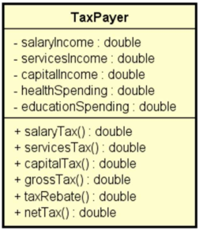

# Desafio 5 DevSuperior - Gerenciamento de Memória e Listas
Quinto desafio do curso Java e Programação Orientada a Objetos Expert do Professor Nélio Alves - Dev Superior.

## Descrição do desafio:
Para calcular o imposto de renda que uma pessoa deve pagar, um país aplica as seguintes regras:
1) Imposto sobre salário: a pessoa paga imposto sobre seu salário conforme tabela abaixo:

| **Salário**              | **Imposto** |
|--------------------------|-------------|
| Abaixo de 3000 por mês   | Isento      |
| 3000 até 5000, exclusive | 10%         |
| 5000 ou acima            | 20%         |

2) Se a pessoa obteve renda com prestação de serviços, o imposto cobrado é de 15%.
3) Se a pessoa obteve ganho de capital (imóveis, ações, etc.), o imposto cobrado é de 20%.
4) A pessoa pode abater até 30% do seu imposto bruto devido com gastos médicos ou educacionais. Mas se seus gastos médicos e educacionais forem abaixo desses 30%, 
apenas os gastos médicos e educacionais podem ser abatidos.

Você deve fazer um programa para ler os dados de N contribuintes, armazenando os dados desses contribuintes em uma lista. Depois, você deve mostrar, para cada contribuinte,
um resumo do imposto conforme exemplos.
   
Você deve utilizar uma classe TaxPayer conforme projeto abaixo para representar cada contribuinte. Repare que sua lista vai ter que ser uma ```List<TaxPayer>```.

Lembre-se de respeitar os nomes apresentados no projeto (como foi fornecido o projeto para você executar, você tem que respeitar a especificação do projeto). 
Sinta-se livre para implementar construtores pra facilitar a instanciação dos objetos.



## Critérios de avaliação:
- [x] Nomes de classes, atributos, métodos e argumentos respeitando o projeto, bem como as convenções de nome para Java;
- [x] Atributos corretos e devidamente encapsulados com métodos get/set;
- [x] Todos métodos corretos calculando os valores corretamente;
- [x] Comportamento do programa correto conforme exemplo.
 
## Competências avaliadas:
- Implementação de solução com classes, atributos e métodos;
- Manipulação de listas em Java.

## Desafios anteriores:
1. https://gist.github.com/paulorc-silva/3953028e80bcd4a808b6d0ee9c275701
2. http://gist.github.com/paulorc-silva/683cb745fc2c3dc04b2090ac887b811e
3. https://github.com/paulorc-silva/Desafio-DevSuperior-Intro-POO
4. https://github.com/paulorc-silva/Desafio-DevSuperior-Construtores-Encapsulamento